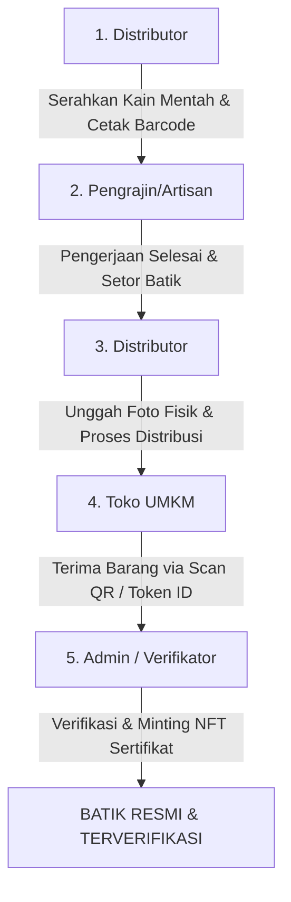

# BatikChain Indonesia 🇮🇩

BatikChain adalah platform sertifikasi keaslian kain batik berbasis blockchain. Sistem ini mengintegrasikan rantai pasok (supply chain) kain batik mulai dari penyerahan kain mentah oleh distributor, pengerjaan oleh pengrajin, pendistribusian kembali oleh distributor, penerimaan oleh toko retail (UMKM), hingga verifikasi akhir dan pencetakan sertifikat NFT keaslian batik secara on-chain oleh administrator/verifikator.

---

## 🔗 Alur Rantai Pasok (Supply Chain)

Berikut adalah 5 tahapan utama perjalanan kain batik dalam ekosistem BatikChain:



1. **Distributor**: Menyerahkan kain mentah ke pengrajin mitra (`FABRIC_ISSUED`) dan menempelkan barcode Token ID unik.
2. **Pengrajin**: Menyelesaikan proses membatik, menyetor batik dengan memindai barcode, dan mendaftarkan batik ke sistem (`REGISTERED`).
3. **Distributor**: Menerima batik jadi dari pengrajin, mengunggah foto fisik kain batik asli, dan memproses distribusi ke toko retailer (`DISTRIBUTED`).
4. **UMKM (Toko Retail)**: Menerima pengiriman fisik kain batik dari distributor, memverifikasi barcode/Token ID, dan mengonfirmasi barang diterima (`RECEIVED`).
5. **Admin**: Memeriksa kecocokan data fisik, lalu melakukan verifikasi akhir melalui MetaMask (menggunakan akun Owner Kontrak Pintar) untuk menerbitkan **NFT Sertifikat Keaslian** secara *on-chain* (`VERIFIED`).

---

## 🚀 Cara Menjalankan Layanan

Menjalankan BatikChain memerlukan 3 jendela terminal utama:

### 1. Terminal 1: Node Blockchain Lokal (Hardhat)
Jalankan node lokal Hardhat untuk mensimulasikan jaringan Ethereum lokal:
```bash
cd contracts
npx hardhat node
```

### 2. Deploy Smart Contract (Hanya jika node baru dijalankan/reset)
Buka terminal baru, deploy kontrak pintar ke node lokal yang sedang berjalan:
```bash
cd contracts
npx hardhat run scripts/deploy.js --network localhost
```
*Salin alamat kontrak yang muncul di konsol dan perbarui jika diperlukan pada file konfigurasi `.env` di root dan `backend/.env` pada variabel `CONTRACT_ADDRESS` / `VITE_CONTRACT_ADDRESS`.*

### 3. Terminal 2: Backend API Server (NestJS)
Jalankan backend server:
```bash
cd backend
npm run start:dev
```
*Backend berjalan di URL: http://localhost:3000*

### 4. Terminal 3: Frontend Web App (Vite + React)
Jalankan frontend:
```bash
npm run dev
```
*Frontend berjalan di URL: http://localhost:5173*

---

## 🦊 Konfigurasi MetaMask (Untuk Admin / Owner Kontrak)

Admin wajib terhubung menggunakan akun **Deployer/Owner Kontrak** (Account #0 dari Hardhat) untuk menandatangani pencetakan NFT sertifikat.

### Langkah 1: Tambahkan Jaringan Lokal Hardhat di MetaMask
*   **Nama Jaringan**: Hardhat Localhost
*   **RPC URL**: `http://127.0.0.1:8545`
*   **Chain ID**: `31337`
*   **Simbol**: `ETH`

### Langkah 2: Impor Akun Owner
Impor akun menggunakan kunci privat (*private key*) pertama dari daftar Hardhat:
*   **Private Key**: `0xac0974bec39a17e36ba4a6b4d238ff944bacb478cbed5efcae784d7bf4f2ff80`
*   **Alamat Wallet**: `0xf39Fd6e51aad88F6F4ce6aB8827279cffFB92266`

---

## 👥 Akun Uji Coba (Testing Credentials)

Berikut adalah daftar akun yang terdaftar dalam database untuk menguji alur rantai pasok:

| Email | Peran (Role) | Password | Nama Pengguna / Keterangan |
| :--- | :--- | :--- | :--- |
| **admin@batikchain.id** | **ADMIN** | `admin123` | Otoritas Penerbit Sertifikat (Verifikator) |
| **distributor@batikchain.id** | **DISTRIBUTOR** | `admin123` | Budi Sentra (Sentra Riau) |
| **sentrapamekasan@gmail.com** | **DISTRIBUTOR** | `Pamekasan123` | Dian (Sentra Pamekasan) |
| **umkm@batikchain.id** | **UMKM** | `admin123` | Dimas (UKM Tenun Riau) |
| **dane@gmail.com** | **UMKM** | `Dimasseto123` | Deni Toko (Toko Batik Retailer) |
| **lea@gmail.com** | **PENGRAJIN** | `Pamekasan123` | Lea (Pengrajin Mitra Sentra Pamekasan) |
| **diva@gmail.com** | **PENGRAJIN** | `Pamekasan123` | Diva (Pengrajin Mitra Sentra Pamekasan) |
| **dima@gmail.com** | **PENGRAJIN** | `Pamekasan123` | Dila (Pengrajin Mitra Sentra Pamekasan) |

---

## ⚙️ Fitur Keamanan & Sinkronisasi Baru
*   **Sinkronisasi Antar-Tab (Multi-tab Session Sync)**: Pindah akun atau keluar (logout) di satu tab secara otomatis memperbarui status login di tab browser lainnya agar token tidak saling bentrok.
*   **Proteksi Double-Registration**: Pengecekan sidik jari secara on-chain mencegah pendaftaran ganda dari data batik yang sama di blockchain.
